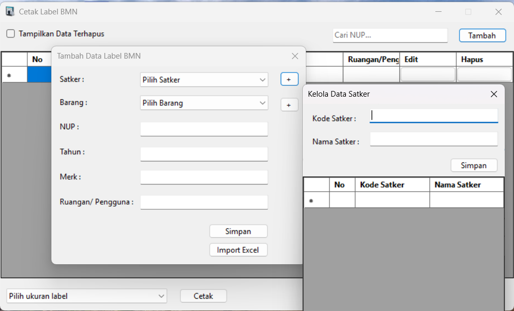

# Cetak Label BMN

 Aplikasi Cetak Label BMN adalah solusi desktop berbasis Windows Forms yang dirancang khusus untuk pencetakan label inventaris Barang Milik Negara (BMN) menggunakan printer label Brother (dengan dukungan SDK b-PAC Ver.3.4(32-bit)[Daftar printer yang didukung](https://support.brother.com/g/s/es/dev/en/bpac/environment/index.html?c=eu_ot&lang=en&navi=offall&comple=on&redirect=on). Aplikasi ini menyediakan antarmuka yang intuitif untuk mengelola data aset, mencetak label kustom, serta melakukan operasi CRUD (Create, Read, Update, Delete) data.

## Fitur Utama

* **Manajemen Data BMN:**
    * Tampilan data label BMN dalam `DataGridView` yang interaktif.
    * Fungsionalitas pencarian (filter) data berdasarkan NUP.
    * Kemampuan *soft delete* dan *restore* data.
    * Edit langsung data label (NUP, Tahun, Merek, Ruangan/Pengguna, Kode Satker, Kode Barang) di dalam grid.
    * Penomoran urut baris otomatis pada grid untuk tampilan yang rapi.
* **Modul Tambah/Edit Data:**
    * Modal (`FormAddData`) untuk menambahkan data label baru dengan input terstruktur (ComboBox untuk Satker/Barang, TextBox untuk detail).
    * Mode edit pada `FormAddData` untuk memperbarui data label yang sudah ada, dengan pengisian otomatis dari data terpilih di grid utama.
* **Manajemen Master Data:**
    * Modal terpisah (`FormManageSatker` dan `FormManageBarang`) untuk mengelola master data Satuan Kerja (Satker) dan Kode Barang.
    * Fungsionalitas tambah, edit (nama), dan hapus data master.
    * Fungsionalitas impor data master (Satker/Barang) dari file Excel (`.xlsx`, `.xls`).
* **Pencetakan Label Kustom:**
    * Integrasi dengan Brother b-PAC SDK untuk pencetakan label presisi.
    * Mendukung pemilihan template label (`.lbx`) yang berbeda.
    * Memungkinkan pencetakan range baris tertentu dari data yang ditampilkan di grid.
    * Dukungan untuk logo kustom pada label (melalui pengaturan gambar yang disimpan).

## Teknologi

* **Bahasa Pemrograman:** C#
* **Platform:** .NET 8 (Windows Forms)
* **Database:** SQLite (tersemat, menggunakan `Microsoft.Data.Sqlite`)
* **UI Framework:** Windows Forms (WinForms)
* **Pencetakan Label:** Brother b-PAC SDK ver.3.4(32 Bit)
* **Impor Excel:** EPPlus (OfficeOpenXml)

## Prasyarat

Untuk menjalankan aplikasi ini, Anda memerlukan:

* **Windows Operating System:** (Windows 10/11)
* **.NET 8 Desktop Runtime:** Aplikasi ini dibangun dengan .NET 8. Jika belum terinstal di sistem Anda, installer aplikasi akan memandu Anda untuk menginstalnya.
* **Brother b-PAC Client Component:** Ini adalah SDK yang diperlukan untuk fungsionalitas pencetakan. Aplikasi akan memberikan peringatan jika tidak terinstal. Anda dapat mengunduhnya dari [situs web Brother Support](https://support.brother.com/) (cari "b-PAC SDK").

## Instalasi

### Dari Rilis GitHub (Direkomendasikan untuk Pengguna)

1.  Kunjungi halaman [Rilis aplikasi ini di GitHub](https://github.com/syzuhri/Cetak-Label-BMN/releases).
2.  Unduh file installer [`LabelSetup.exe`](https://github.com/syzuhri/Cetak-Label-BMN/releases/download/v1.0.0/LabelSetup.exe).
3.  Jalankan `LabelSetup.exe` dan ikuti petunjuk instalasi.
    * **Penting:** Pastikan **Brother b-PAC Client Component** terinstal di komputer Anda. **Component** b-PaAC Client sudah include dalam installer aplikasi ini, atau bisa di download dari situs resmi **Brother**.

### Dari Kode Sumber (Untuk Pengembang)

1.  **Clone Repositori:**
    ```bash
    git clone [https://github.com/syzuhri/Cetak-Label-BMN.git](https://github.com/syzuhri/Cetak-Label-BMN.git)
    cd Cetak-Label-BMN
    ```
2.  **Buka di Visual Studio:**
    * Buka file `LabelPortable.sln` di Visual Studio 2022.
3.  **Instal NuGet Packages:**
    * Di Visual Studio, buka **Tools** > **NuGet Package Manager** > **Manage NuGet Packages for Solution...**.
    * Pastikan semua paket berikut terinstal: `Microsoft.Data.Sqlite`, `OfficeOpenXml`, `bpac`. Jika ada yang hilang, instal melalui tab "Browse".
4.  **Siapkan Database SQLite:**
    * Aplikasi akan secara otomatis membuat file `db/label.db` dan skema database pertama kali dijalankan di folder `bin/Debug` (saat pengembangan) atau di folder instalasi (saat deploy).
    * Jika Anda perlu mengosongkan database (menghapus semua data dan mereset auto-increment), gunakan alat seperti [DBeaver](https://dbeaver.io/) atau [DB Browser for SQLite](https://sqlitebrowser.org/) untuk menghapus data di tabel `label`, `satker`, `barang` dan mereset `sqlite_sequence`.
    * Pastikan `view_BMN2` Anda dibuat dengan definisi yang benar di database Anda (secara manual menggunakan DBeaver/DB Browser jika diperlukan).
5.  **Siapkan Aset Aplikasi:**
    * Pastikan Anda memiliki folder `resources` di root proyek Anda (di samping file `.csproj`).
    * Tempatkan file template label (`.lbx`) Anda (misalnya `nup36.lbx`, `nup24.lbx`, `nup18.lbx`) di dalam folder `resources`.
    * Tempatkan file ikon aplikasi (`app.ico`) di dalam folder `resources`.
6.  **Build Proyek:**
    * Di Visual Studio, pilih **Build** > **Rebuild Solution** (dalam konfigurasi `Release` untuk deployment).
7.  **Jalankan Aplikasi:**
    * Tekan `F5` untuk menjalankan aplikasi dalam mode debug, atau navigasi ke `bin/Debug` (atau `bin/Release`) dan jalankan `LabelPortable.exe`.

## Penggunaan

1.  **Tampilan Utama:** Aplikasi akan menampilkan grid data label BMN.
2.  **Pencarian & Filter:** Gunakan kotak pencarian dan checkbox untuk memfilter data.
3.  **Tambah Data Baru:** Klik tombol "Tambah Data Label" untuk membuka modal pengisian data.
4.  **Edit Data Grid:** Double-klik pada baris di grid untuk membuka modal edit (`FormAddData`) dengan data yang sudah terisi. Anda juga bisa mengedit beberapa kolom langsung di grid.
5.  **Kelola Master Data:** Gunakan tombol "+" di modal tambah data untuk membuka modal manajemen Satker atau Barang.
6.  **Impor Data Master:** Di modal manajemen Satker/Barang, gunakan tombol "Impor Excel" untuk memasukkan data dari spreadsheet.
7.  **Pengaturan Logo:** Akses pengaturan aplikasi untuk memilih file gambar logo yang akan digunakan pada label yang dicetak.
8.  **Cetak Label:** Pilih baris atau tentukan range baris di grid, pilih ukuran template, dan klik "Cetak".

## Kontribusi

Kontribusi Anda sangat diterima! Jika Anda ingin berkontribusi, silakan fork repositori ini dan ajukan Pull Request dengan perubahan Anda.

## Lisensi

Aplikasi ini dilisensikan di bawah Lisensi MIT. Lihat file `LICENSE` untuk detail lebih lanjut.

---
